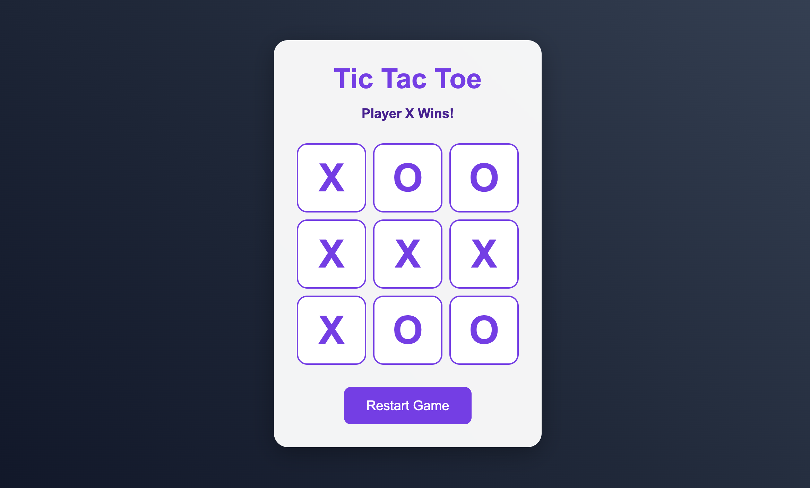

# Modern Tic Tac Toe Game

A beautiful, interactive Tic Tac Toe game built with HTML, CSS, and JavaScript. Features a modern UI design with sound effects and smooth animations.

## Features

- 🎮 Modern and responsive design
- 🎵 Interactive sound effects
- ✨ Hover effects and animations
- 🎯 Win detection
- 🤝 Draw detection
- 🔄 Restart game functionality
- 🎨 Beautiful gradient background
- 💎 Glass-morphism design elements

## How to Play

1. Open `index.html` in your web browser
2. Players take turns clicking on empty cells to place their mark (X or O)
3. The game will automatically detect wins or draws
4. Click the "Restart Game" button to start a new game

## Technologies Used

- HTML5
- CSS3
- JavaScript (ES6+)